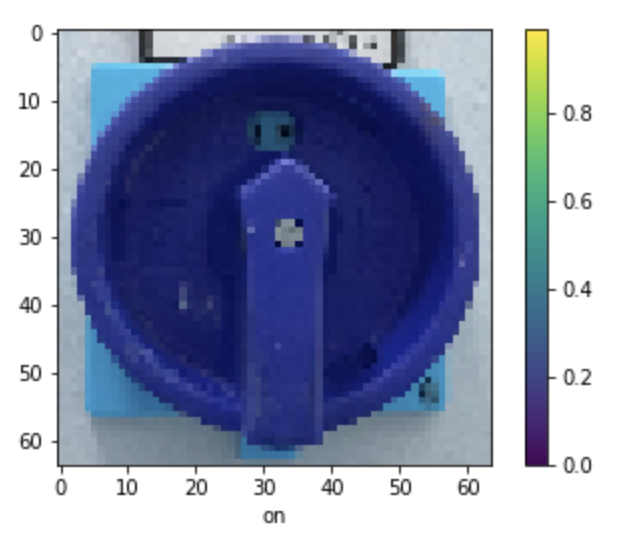

# Simple CNN Button On-Off Classifier
This project shows an example of how to use a Keras model to implement classification using a simple CNN for images.

## Installation
1. Pull the code
2. Create a Python environment and activate it

*e.g.* 
`virtualenv -p python3 .venv`
`source .venv/bin/activate`

3. Install requirements

*e.g.*
`pip install -r requirements.txt`

4. There are 2 notebooks (main.ipynb, augment_button/augment_button.ipynb), one for the training process and the other one for the image augmentation process

- The augmentation is done by using the [Augmentor](https://github.com/mdbloice/Augmentor) package

5. To generate the images, run the generator notebook and copy the files from *augment_button/images* into *dataset/*

*Value/class* names are taken from the folder name in train, which maps the values of the variable MAP_CLASSES in main.ipynb
*e.g.*

6. main.ipynb expects images to be .jpg instead of .png resulting from the augmentation. You can use the following command:

*e.g.*
`mogrify -format jpg *.png`

7. Once images are augmented, you can manually create a train/test split as you want

- The *dataset/train* folder has one folder for each class
- The *dataset/test* folder has all the images dropped-in. Take into account that the class names for this images are taken from the image name
    - *e.g.* off_1.jpg, on_153.jpg

The classification predicts the state of the button
*e.g.*

